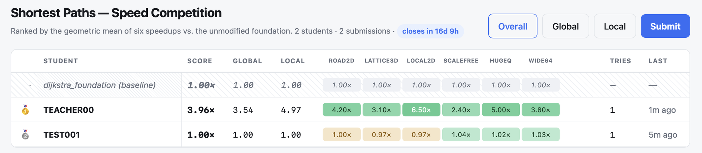
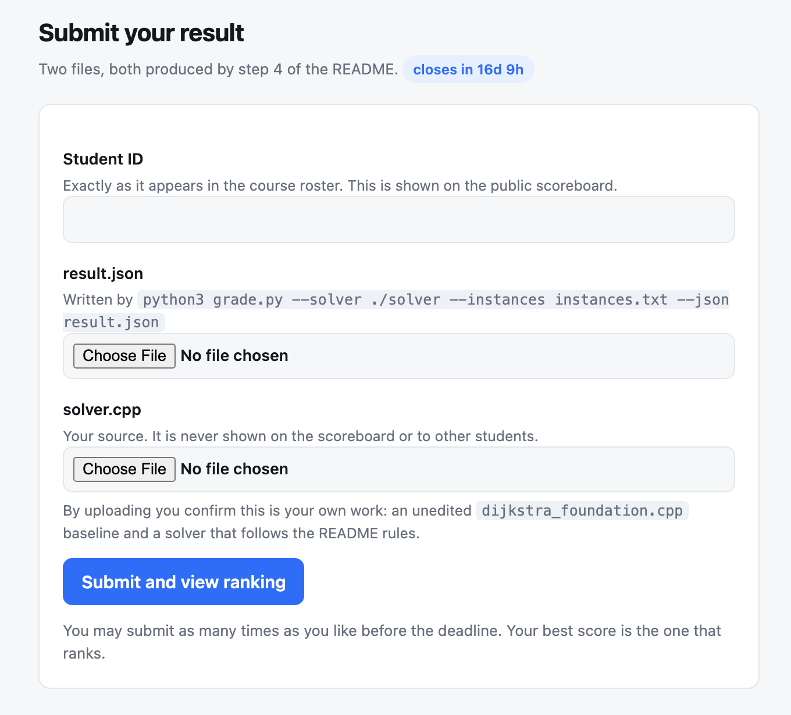

# Shortest-Path Speed Competition — Course Announcement

*[繁體中文版本 → COMPETITION.zh-TW.md](COMPETITION.zh-TW.md)*

You are given a working shortest-path program. Your job is to make it **much
faster** without changing a single one of its answers. How much faster is
literally your score: a solver that is 40× the speed of the one you were given
scores 40.

## At a glance

| | |
|---|---|
| **What you do** | Copy `dijkstra_foundation.cpp` to `solver.cpp` and speed it up |
| **What you hand in** | Two files: `solver.cpp` and `result.json` |
| **Where** | **https://shortestpaths.ccu2026algorithm.workers.dev** (public scoreboard, hosted on Cloudflare — no login, no VPN, works from anywhere) |
| **Deadline** | **27 Sep 2026, 23:59 Taipei.** Late uploads are refused by the server |
| **Scored on** | Six datasets, listed below |
| **Your score** | The geometric mean of your six speedups over the baseline |
| **Attempts** | Unlimited before the deadline; your **best** score is the one that ranks |
| **Language** | C++17, standard library only, single-threaded, one file |

Everything you need is in this repository. `README.md` is the authoritative
spec; this page is the announcement and explains *why* each rule is there.

## 1. The task

`dijkstra_foundation.cpp` is a correct, ordinary Dijkstra with a binary heap.
It reads a graph, answers every query one at a time, and writes one distance
per line. It is slow, and it is your baseline.

You copy it to `solver.cpp` and improve it. Same command line, same input,
**byte-identical output**, less time. Nothing else in the repository is yours
to change — in particular, do not touch `dijkstra_foundation.cpp`: `grade.py`
compiles it itself to measure your baseline, so editing it only lowers the
number you are trying to raise.

## 2. Getting started — four commands

```sh
make foundation                        # 1. build the baseline
scripts/download_large.sh              # 2. fetch the scored data (185 MB, once)
cp dijkstra_foundation.cpp solver.cpp  # 3. this file is your assignment
make solver                            #    ...edit solver.cpp, rebuild...
python3 grade.py --solver ./solver --instances instances.txt --json result.json   # 4. score
```

Step 4 prints a table, writes `result.json`, and the `Overall geomean` line is
your score. Before you change anything it is about 1.0, because `solver.cpp`
*is* the baseline at that point.

Two things to know before you start:

- **Check your toolchain first**: `make foundation && make check-data`. If it
  prints anything but `ok`, your compiler is broken — ask before going further.
- **The scored run is slow.** The untouched baseline needs about **1.7 hours of
  CPU** to finish all six scored instances. While you develop, use the small
  dev set that is already in the repo (about 1.5 minutes):
  `python3 grade.py --solver ./solver --instances instances_dev.txt`.
  The dev set is for correctness and rough speed. Only `instances.txt` is
  scored.

## 3. The six datasets

Six instances are scored, and they are deliberately different from one
another: a trick that wins on one graph can do nothing — or actively hurt — on
the next. Two are in the **LOCAL** track (short-range queries dominate), four
are in the **GLOBAL** track (long-range queries dominate). The board reports
both sub-means, but the **overall** mean is what ranks you.

| # | instance | track | vertices | edges | queries | what the graph is | what the queries are |
|---|---|---|---:|---:|---:|---|---|
| 1 | `road2d_large` | GLOBAL | 300,304 | 1,629,732 | 200,000 | directed road-like network with integer coordinates; 8 % one-way; local / arterial / highway speed classes | targets spread over Dijkstra ranks 2⁸–2¹⁷ (short trips to long ones) |
| 2 | `lattice3d_large` | GLOBAL | 300,763 | 902,289 | 30,000 | 3-D torus lattice, every vertex of degree 6, no coordinates, weights log-uniform 1–10⁶ | uniform random pairs |
| 3 | `local2d_large` | LOCAL | 300,304 | 600,608 | 300,000 | 2-D torus lattice, degree 4, weights uniform 1–1000 | 90 % short-range (target within rank 4096), 10 % uniform |
| 4 | `scalefree_large` | GLOBAL | 300,000 | 873,003 | 50,000 | directed power-law graph (γ = 2.1), 3 % of vertices are sinks, weights log-uniform 1–10⁴ | 70 % uniform, 30 % aimed at the top 0.1 % hub vertices; about 3 % of targets are **unreachable** and must print `-1` |
| 5 | `hugeq_large` | GLOBAL | 50,176 | 271,492 | 600,000 | the small road graph — by far the smallest here | uniform random pairs, but **600,000 of them** |
| 6 | `wide64_large` | LOCAL | 1,999,396 | 3,998,792 | 30,000 | 2-D torus lattice, weights 10⁸–10⁹; the biggest graph in the set | targets at ranks 2¹²–2²⁰; true distances **exceed 2³²**, so 32-bit distances silently overflow |

About 0.1 % of the queries in every instance have `s == t`; the answer is `0`.

Each instance is four files in `instances/`: `<name>.graph`, `<name>.queries`,
`<name>.answers` (the key `grade.py` checks you against) and
`<name>.meta.json`, which tells you V, E, the weight range, the query mix and
the maximum distance. Read the meta files — they are free information.

The `_dev` versions of the same six families (about 50k vertices, 10k queries)
are committed to the repository for your own quick testing.

**The final grading uses fresh instances**, generated by the same code with the
same parameters and a *different random seed*. Anything that depends on the
exact bytes of the released files will not carry over; anything that depends on
the structure of the graphs will. `tools/gen/` is the real generator, so you
can make your own practice instances with your own seed (see the README).

## 4. How the score works — the ×-factor

For each instance:

```
speedup = T_base / T_solver
```

`T_base` is the unmodified baseline and `T_solver` is your program, **both
timed by `grade.py` on your own machine, in the same run**. This is why the
score is a ratio and not a time: it cancels out how fast your laptop is, so a
fast machine buys you nothing and a slow one costs you nothing.

Your score is the **geometric mean of the six speedups**:

```
score = (s₁ × s₂ × s₃ × s₄ × s₅ × s₆)^(1/6)
```

so a score of 17.4 means "on average, 17.4 times faster than the program you
started with".

Three consequences worth understanding before you optimise anything:

- **There is no cap.** 400× faster scores 400. The top of the field is not
  tied.
- **A failed instance scores 0.1 and is never dropped.** Wrong answers, a
  timeout, too much memory, extra threads — one bad instance out of six
  multiplies your product by 0.1.
- **The geometric mean punishes unevenness.** Being brilliant on five
  instances does not rescue the sixth.

Here is the illustrative run from the README — fast on four instances, modest
on one, wrong on one:

```
category instance                        T_base   T_solver   peakRSS    speedup  note
GLOBAL   road2d_large.graph             733.1        6.9      210M    106.245  ok
GLOBAL   lattice3d_large.graph         1034.2      412.6      180M      2.506  ok
LOCAL    local2d_large.graph            870.5       14.2      160M     61.303  ok
GLOBAL   scalefree_large.graph          918.0       10.1      190M     90.891  ok
GLOBAL   hugeq_large.graph             1550.3        8.4       40M    184.560  ok
LOCAL    wide64_large.graph                 -          -      900M      0.100  WRONG

Overall                 geomean = 17.361  (n=6)
```

Those five correct instances alone are worth about **49×**. The single wrong
one drags the score down to **17.4×**. Correctness first, then speed.

### What the notes mean

| note | meaning | score for that instance |
|---|---|---|
| `ok` | correct, timed | `T_base / T_solver` |
| `WRONG` | output differs from the answer key | 0.1 |
| `TIMEOUT` | exceeded 3600 s | 0.1 |
| `MEMORY` | exceeded 4 GB | 0.1 |
| `THREADS` | used more than one thread | 0.1 |
| `NONDETERMINISTIC` | the three timing runs did not agree | 0.1 |
| `CRASH` / `NOOUTPUT` | non-zero exit, or no output file | 0.1 |

### Two details about the measurement

- **`T_base` is extrapolated, not run in full.** Running the baseline over
  600,000 queries every time you score yourself would cost half an hour per
  instance, so `grade.py` times it on two short prefixes of the query file and
  fits `T(q) = a + b·q`. The error is a few percent and is *the same for
  everybody on a given instance*, so it cancels out of the ranking.
- **Your solver is run three times and the best time is kept.** Machine noise
  is a few percent — don't chase improvements smaller than that, and close
  other programs while scoring.

## 5. The rules

Your `solver.cpp` must:

1. Be a **modified copy of `dijkstra_foundation.cpp`**, not a rewrite from
   scratch.
2. Keep the command line: `./solver <graph> <queries> <output>`.
3. Produce **exactly** the baseline's output on every instance (`-1` for
   unreachable).
4. Be **C++17 using only the standard library**.
5. Be a **single file**: everything you write lives in `solver.cpp`, with no
   headers of your own. `#include` only standard library headers.
6. Be **single-threaded**.
7. Stay under **4 GB of memory** and **3600 s per instance**.
8. Contain **no precomputed answers**.

`grade.py` enforces rules 3, 6 and 7 automatically, and they are enforced
again when the instructor re-runs your solver. Rules 1, 4, 5 and 8 are checked
by reading your `solver.cpp` — which is exactly why the source is uploaded
together with the numbers.

Do **not** edit `dijkstra_foundation.cpp`. Do not edit `grade.py`, the answer
keys, or anything under `instances/`.

## 6. Where you submit — the scoreboard

Submissions go to the course scoreboard, a small public site running on
Cloudflare:

### **https://shortestpaths.ccu2026algorithm.workers.dev**

It is open to anyone with the link — no account, no VPN, and it works equally
well from the lab, from home, or from your phone.

#### The board



- The header shows how many students have submitted, how many submissions there
  are in total, and a live countdown to the deadline.
- **Overall / Global / Local** switch the ranking key. **Overall is the
  official one**; the other two are there so you can see which track you are
  weaker in.
- The greyed row pinned at 1.00× is `dijkstra_foundation` itself — the line you
  have to beat.
- Each student row shows the overall score, the two track means, **all six
  per-instance speedups**, the number of attempts (*Tries*) and how long ago
  the last one was. Rows are keyed by **student ID, which is public**; your
  source code is not.

#### The submit form



1. Open the scoreboard and click **Submit** (top right).
2. Enter your **Student ID**, exactly as it appears in the course roster.
3. Choose your **`result.json`** (written by step 4) and your **`solver.cpp`**.
4. Click **Submit and view ranking** — you are redirected to the board with
   your row highlighted.

#### What the server checks

- It **re-derives your score** from the per-instance times inside
  `result.json` and ranks on that. Uploads that were not produced by
  `grade.py --json`, or whose numbers do not add up, are rejected with a
  message telling you what is wrong.
- `result.json` records the **SHA-256 of the `solver.cpp` it was measured
  from**, so the two files must come from **the same run**. A `result.json`
  from one attempt beside a `solver.cpp` from another is rejected.
- Your `solver.cpp` is stored **for the instructor only**. It is never shown on
  the board or to other students.
- **Submit as often as you like.** Every attempt is kept, and your best score
  ranks — so upload early, and upload often. There is no penalty for a bad
  attempt, and an early upload proves your pipeline works.
- After **27 Sep 2026, 23:59 Taipei** the board closes and uploads are refused.
  Do not plan to submit in the last hour: the scored run itself can take a long
  time.

## 7. Before you upload — checklist

- [ ] `make check-data` says `ok` (your toolchain is sane).
- [ ] `solver.cpp` is a modified copy of the baseline, one file, C++17,
      standard library only, single-threaded.
- [ ] `dijkstra_foundation.cpp` is untouched
      (`git diff dijkstra_foundation.cpp` prints nothing).
- [ ] The dev set is clean: every row says `ok`.
- [ ] A full scored run finished: `python3 grade.py --solver ./solver
      --instances instances.txt --json result.json`, all six rows `ok`.
- [ ] You upload **that** `result.json` together with **that** `solver.cpp`.

## 8. Questions you are likely to have

**My laptop is old — am I at a disadvantage?**
No. Your score is `T_base / T_solver`, and both are measured on your machine in
the same run. A slower machine makes both numbers bigger and the ratio the
same.

**Can I use threads, OpenMP, or a GPU?**
No. Single-threaded C++17, standard library only. `grade.py` detects extra
threads and scores that instance 0.1.

**Can I store the answers, or precompute them into the binary?**
No — rule 8. Remember that the final grading uses freshly generated instances,
so it would not help anyway.

**Can I make my own test data?**
Yes, and you should. `tools/gen/` is the real generator; the README shows how
to generate instances with your own seed and grade against them.

**Do I have to be correct on every instance?**
Effectively, yes. One `WRONG` costs roughly two thirds of a good score (see the
worked example above).

**Something in the rules is unclear.**
Ask the instructor before the deadline rather than guessing. `README.md` is the
authoritative text; where this announcement and the README disagree, the README
wins.

Good luck — and remember that the interesting part of this assignment is not
micro-optimisation, but the algorithms you choose.
